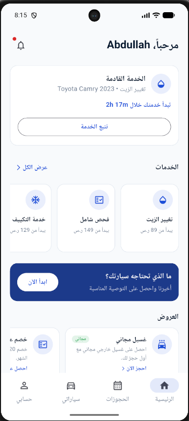
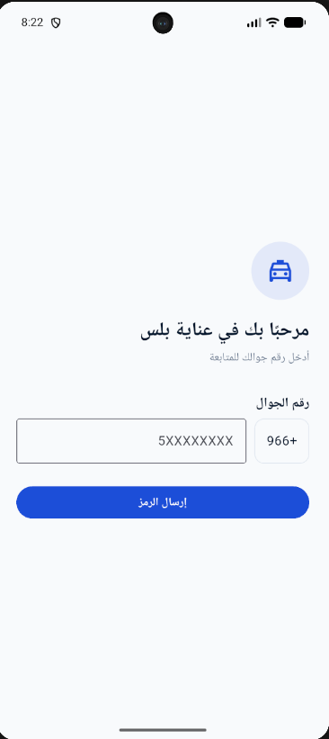
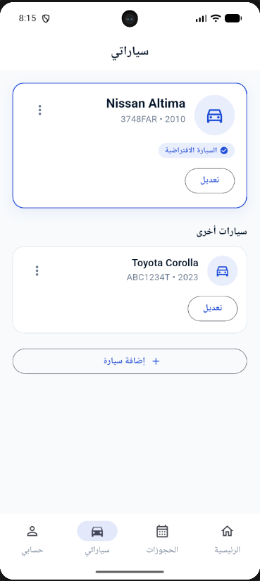
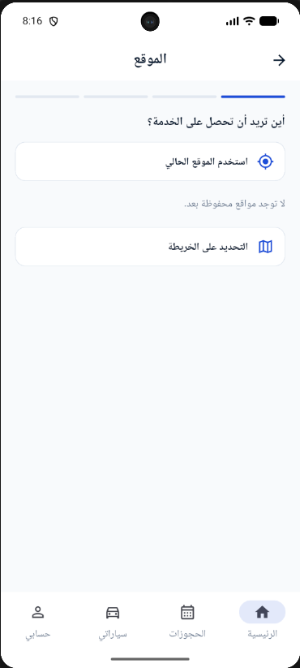
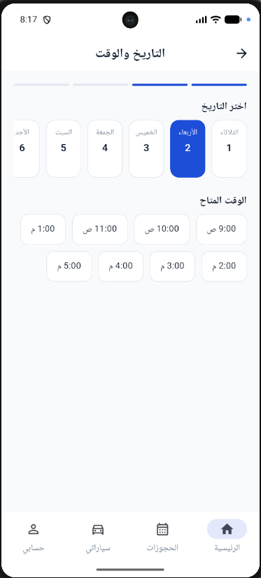
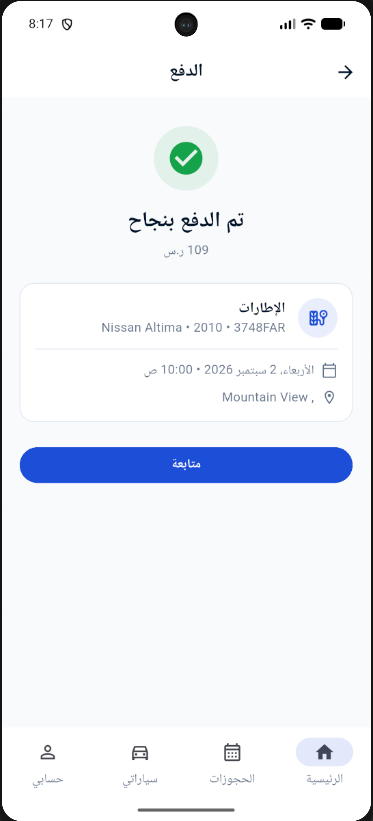
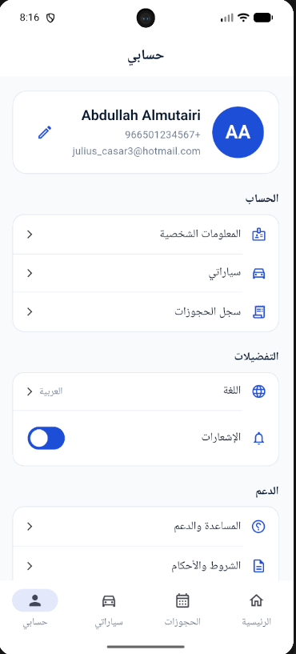
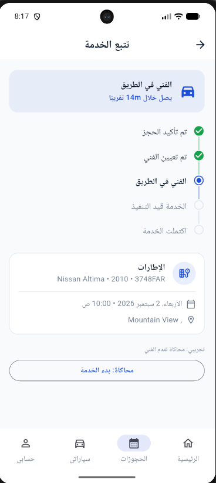
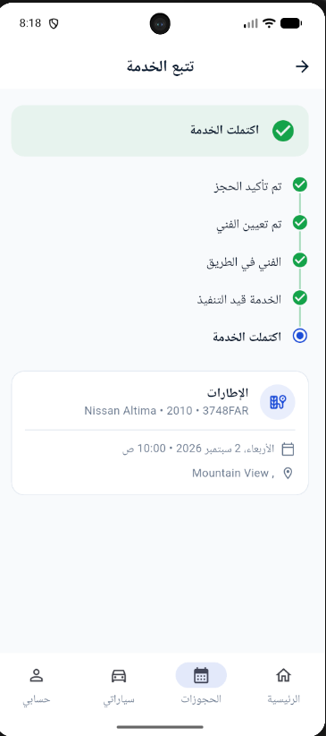

# Anaaya Plus (عناية بلس)

<p align="center">
  
</p>


[](https://flutter.dev/)
[](https://firebase.google.com/)
[](https://supabase.com/)
[](https://github.com/AJC938/anaaya_plus/actions/workflows/flutter.yml)
[](LICENSE)

> **Anaaya Plus** is a Flutter-based automotive service booking platform for the Saudi market. Customers can discover services, manage vehicles, choose locations and time slots, complete a test payment flow, and follow a simulated technician-dispatch lifecycle.

**Project type:** Software-engineering portfolio / test application  
**Primary client:** Flutter / Dart  
**Backend services:** Firebase + Supabase Edge Functions  
**Localization:** Arabic (RTL) + English (LTR)

---

## Overview

Anaaya Plus was built to demonstrate more than a collection of UI screens. The project implements a complete customer-facing booking lifecycle with authentication, persistence, authorization, scheduling, notifications, backend execution, localization, automated tests, and documented architectural boundaries.

The core journey is:

```text
Phone number
    ↓
OTP verification
    ↓
Firebase authenticated session
    ↓
Service selection
    ↓
Vehicle + service options
    ↓
Location
    ↓
Date / time slot
    ↓
Booking review
    ↓
Test payment
    ↓
Confirmation
    ↓
Technician-dispatch tracking
    ↓
Completed
```

> **Important:** This is a portfolio/test application, not a production automotive service. Payment, SMS delivery, and technician dispatch are intentionally simulated/test-mode components.

---

## Key Features

### Authentication

- Custom phone-number + OTP authentication flow.
- Supabase Edge Functions handle OTP generation and verification.
- OTP verification produces a Firebase Custom Token.
- Flutter exchanges the token through `FirebaseAuth.signInWithCustomToken()`.
- Server-side OTP controls include expiry, attempt limits, resend cooldown, rate limiting, one-time use, and replay rejection.

### Automotive services

- Service catalog.
- Per-service options and dynamic pricing.
- Vehicle add/edit/delete management.
- Booking lifecycle and cancellation.

### Scheduling

- Date/time slot selection.
- Firestore-backed slot availability.
- Transaction-based slot claiming to reduce race conditions between concurrent clients.

### Location

- Saved customer locations.
- Current-location detection.
- Map-based location picker.
- Geocoding/location services.

### Payments

- Local test payment simulation.
- Firestore-backed payment record.
- No real gateway, card processing, or money movement.

### Tracking & notifications

- Simulated technician-dispatch lifecycle:
  `Assigned → On the way → In progress → Completed`.
- Booking cancellation where permitted by the current state.
- Firebase Cloud Messaging push notifications.
- In-app notification history/device-token handling.

### Localization

- Arabic-first RTL experience.
- English LTR experience.
- Flutter `gen-l10n` localization workflow.

---

## Architecture

```text
                         ┌──────────────────────┐
                         │    Flutter / Dart     │
                         │                      │
                         │ go_router            │
                         │ Riverpod             │
                         │ Feature modules      │
                         └──────────┬───────────┘
                                    │
                  ┌─────────────────┼──────────────────┐
                  │                 │                  │
                  ▼                 ▼                  ▼
          Firebase Auth      Cloud Firestore          FCM
          Custom Token       app data + rules        Push
                  ▲
                  │
                  │ OTP backend
                  │
          ┌───────┴────────┐
          │ Supabase Edge  │
          │   Functions    │
          └───────┬────────┘
                  │
             ┌────┴─────┐
             ▼          ▼
       Twilio TEST   Firebase Admin
          API        Custom Token
```

The client is organized around feature boundaries and repository/data abstractions. Firebase is the session and application-data boundary, while Supabase Edge Functions provide isolated backend execution for the custom OTP flow.

For the detailed architecture and design decisions, see [`docs/architecture/ARCHITECTURE.md`](docs/architecture/ARCHITECTURE.md) and [`docs/adr/0001-flutter-firebase-supabase.md`](docs/adr/0001-flutter-firebase-supabase.md).

---

## Technology Stack

| Layer | Technology |
|---|---|
| Mobile client | Flutter / Dart |
| State management | Riverpod |
| Navigation | go_router |
| Authentication | Firebase Authentication |
| Database | Cloud Firestore |
| Push notifications | Firebase Cloud Messaging |
| Backend execution | Supabase Edge Functions / Deno |
| OTP test delivery | Twilio TEST API |
| Maps | flutter_map / OpenStreetMap |
| Location | geolocator / geocoding |
| Localization | Flutter `gen-l10n` |
| Testing | Flutter test / widget tests / Deno tests |
| CI | GitHub Actions |

---

## Project Structure

```text
anaaya_plus/
├── android/                 # Android platform project
├── ios/                     # iOS platform project
├── lib/
│   ├── app/                 # App bootstrap, router, application shell
│   ├── core/                # Shared infrastructure, theme, localization, widgets
│   ├── features/
│   │   ├── auth/            # Phone / OTP authentication
│   │   ├── booking/         # Booking lifecycle and tracking
│   │   ├── bookings/        # Booking list
│   │   ├── cars/            # Vehicle management
│   │   ├── home/            # Home experience
│   │   ├── location/        # Locations and map picker
│   │   ├── notifications/   # FCM and notification history
│   │   ├── payment/         # Test payment simulation
│   │   ├── profile/         # Profile/settings
│   │   ├── scheduling/      # Slot availability/claiming
│   │   └── services/        # Service catalog/options
│   └── l10n/                # ARB localization sources
├── supabase/
│   └── functions/           # OTP/backend Edge Functions + shared tests
├── test/                    # Flutter unit/widget/repository tests
├── Screenshots/             # Curated UI evidence
├── docs/
│   ├── architecture/        # Architecture documentation
│   ├── adr/                 # Architecture decision records
│   ├── testing/             # Testing strategy and evidence
│   └── portfolio/           # Portfolio documentation hub
├── firestore.rules          # Firestore authorization rules
├── firestore.indexes.json   # Firestore indexes
├── pubspec.yaml             # Flutter dependencies and project metadata
└── README.md
```

---

## Screenshots

Selected screens from the current project snapshot:

| Home | Login | Services |
|---|---|---|
|  |  |  |

| Location | Date | Confirmation |
|---|---|---|
|  |  |  |

| Profile | Tracking | Booking completion |
|---|---|---|
|  |  |  |

---

## Testing

The repository includes automated tests across client, business logic, repositories, UI flows, and backend shared utilities.

### Current documented baseline

| Area | Command | Result |
|---|---|---|
| Flutter tests | `flutter test` | **629 passed, 0 failed** |
| Flutter analysis | `flutter analyze` | **0 errors, 0 warnings; 1 info-level style finding** |
| Deno backend tests | `deno test --allow-net --allow-env supabase/functions/_shared/` | **70 passed, 0 failed** |

Coverage includes authentication/OTP behavior, Firebase Custom Token exchange, repositories, booking/payment/notification state transitions, scheduling behavior, and major Arabic/English widget flows.

See [`docs/testing/TESTING.md`](docs/testing/TESTING.md) for the testing strategy.

---

## Getting Started

### Prerequisites

- Flutter SDK compatible with the project's Dart SDK constraint.
- Android Studio or an Android-capable Flutter environment.
- A configured Firebase project for the application's Firebase services.
- Supabase CLI only if you need to run/deploy the OTP backend.

### Install

```bash
flutter pub get
```

### Run

```bash
flutter run
```

### Verify

```bash
flutter analyze
flutter test
```

Localization is generated from the ARB sources under `lib/l10n/` and should not be edited as generated output.

---

## Backend / OTP Flow

The custom OTP flow is intentionally separated from the Flutter client:

```text
Flutter
  │
  ├── request OTP ──────→ Supabase send-otp
  │                           │
  │                           └── generate/hash/store OTP
  │                           └── Twilio TEST API
  │
  └── verify OTP ───────→ Supabase verify-otp
                              │
                              └── validate OTP controls
                              └── mint Firebase Custom Token
                                      │
                                      ▼
                              FirebaseAuth session
```

This separation demonstrates a real backend execution boundary instead of putting the entire authentication workflow inside the client.

---

## Security & Trust Boundaries

- Firestore security rules are part of the authorization boundary.
- OTP verification controls are enforced server-side.
- Production service-account private keys must never be committed.
- Payment is not a trusted financial system: the current implementation is explicitly a local simulation.
- Test-mode SMS credentials do not represent production SMS delivery.

See [`SECURITY.md`](SECURITY.md) for the repository security policy.

---

## Known Limitations

This project intentionally stops short of production infrastructure:

- No real payment gateway.
- No real SMS delivery.
- No technician-facing application/role.
- Technician tracking is a simulated state lifecycle rather than real-time technician GPS.
- No production load testing or enterprise hardening claim.
- The demo recording is hosted outside the repository because the source video exceeds GitHub's normal single-file size limit.

These limitations are part of the project's scope rather than hidden implementation gaps.

---

## Engineering Highlights

Anaaya Plus demonstrates:

- Feature-oriented Flutter architecture.
- Repository/data abstraction.
- Riverpod state management.
- Declarative routing with go_router.
- Custom authentication flow using OTP → Firebase Custom Token.
- Server-side OTP security controls.
- Firestore authorization rules.
- Transaction-based scheduling/slot claiming.
- Push notification integration.
- Arabic RTL + English LTR localization.
- Automated unit, repository, widget, and backend tests.
- CI quality gates through GitHub Actions.
- Architecture documentation and ADRs.

---

## Documentation

- [Architecture](docs/architecture/ARCHITECTURE.md)
- [Architecture Decision Record](docs/adr/0001-flutter-firebase-supabase.md)
- [Testing Strategy](docs/testing/TESTING.md)
- [Portfolio Documentation](docs/portfolio/README.md)
- [Contributing](CONTRIBUTING.md)
- [Security Policy](SECURITY.md)
- [Code of Conduct](CODE_OF_CONDUCT.md)
- [Changelog](CHANGELOG.md)

---

## License

This project is licensed under the MIT License. See [`LICENSE`](LICENSE).

---


